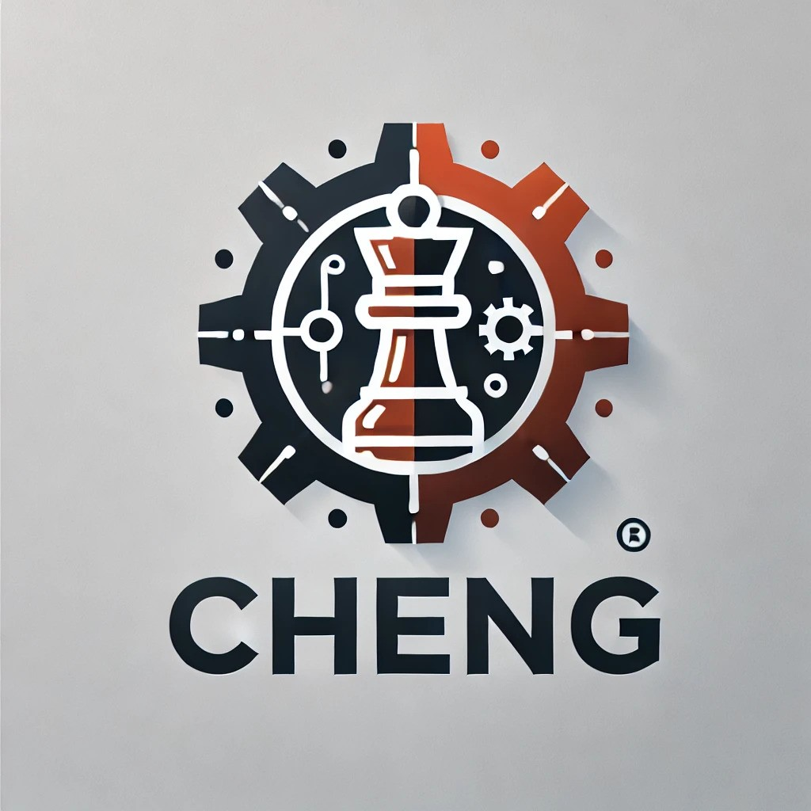

# Cheng - A Simple Rust Chess Engine

**Cheng** is an educational chess engine written in Rust. It is designed to be simple and straightforward, serving as a learning tool for those interested in understanding how chess engines work. Cheng is fully compliant with the Universal Chess Interface (UCI) protocol, allowing it to communicate with any UCI-compatible GUI.

## Features

- **UCI Compliant**: Cheng supports the UCI protocol, making it compatible with popular chess GUIs like [Arena](http://www.playwitharena.de/) and [CuteChess](https://github.com/cutechess/cutechess).
- **Educational**: Designed to be easy to understand, Cheng aims to help developers learn the inner workings of a chess engine.
- **Written in Rust**: Cheng is built using Rust, offering the benefits of memory safety and modern systems programming.

## Requirements

- **Rust**: Version 1.79.0 (129f3b996 2024-06-10) is required to build and run Cheng.

## Installation

1. Install Rust from [rust-lang.org](https://www.rust-lang.org/).
2. Clone the repository:
    ```bash
    git clone https://github.com/yourusername/cheng.git
    ```
3. Navigate to the project directory:
    ```bash
    cd cheng
    ```
4. Build the project:
    ```bash
    cargo build --release
    ```
5. Run the chess engine with a UCI-compatible GUI, such as Arena or CuteChess.

## Usage

Once Cheng is built, it can be used in any UCI-compatible GUI. To launch Cheng directly from the command line:

```bash
cargo run --release
```

Then configure your GUI to use the path to Cheng's executable as the UCI engine.

## Contributing

This project is inspired by BBC chess engine created by Code Monkey King (aka maksimKorzh). You can check his amazing work at his youtube channel https://www.youtube.com/@chessprogramming591. Also feel free to fork this repo and contribute to it however you would like.

## License

See the [LICENSE](LICENSE.txt) file for more details.


